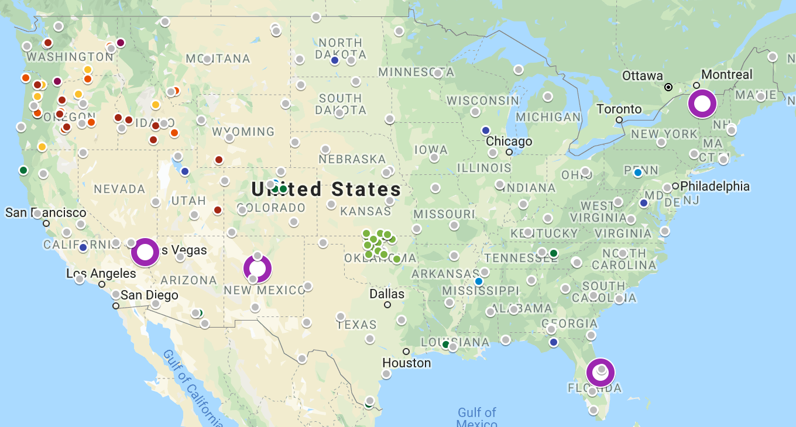

Reference Data
==============

The Solar Forecast Arbiter includes a set of reference irradiance and PV power data that all users may access. The image below shows a the status of the reference data set as of June 2019. Click [here](https://www.google.com/maps/d/u/0/viewer?mid=1sKsG0Uwy4Ozio2a1yfwaaE6OGqGQV1v8&ll=52.42446198117135%2C-119.04500000000004&z=3) to access a zoomable map and legend.

The data set includes the following networks:

* [NOAA SURFRAD](https://www.esrl.noaa.gov/gmd/grad/surfrad/)
* [NOAA SOLRAD](https://www.esrl.noaa.gov/gmd/grad/solrad/index.html)
* [NOAA CRN](https://www.ncdc.noaa.gov/crn/qcdatasets.html)
* [NREL MIDC](https://midcdmz.nrel.gov/)
* [U. Oregon SRML](http://solardat.uoregon.edu/)
* [DOE ARM](https://www.arm.gov/data)
* [Sandia RTC](https://pv-dashboard.sandia.gov/)

Parsers for most of these networks are available in [pvlib-python](https://pvlib-python.readthedocs.io/en/stable/api.html#io-tools).

The Solar Forecast Arbiter imports new reference data from each of these networks each night.

Recommended steps to explore the reference data:

1. Click [here](https://solarforecastarbiter.org/referencedata/) to access a zoomable map.
2. Visit [dashboard.solarforecastarbiter.org/sites](https://dashboard.solarforecastarbiter.org/sites/)
3. Type *reference* in the search bar to restrict the listed sites to the reference data set. Alternatively, click the *Provider* menu to select/deselect options.
4. Click through sites from a few different providers. Hint: use the search bar to filter sites by name e.g. *surfrad* or *srml*.
5. Be sure to visit the Observation page for each site to see the data available from that site. To do so, click the *Observations* link under the name of the site and above the site metadata table. For example, [NRED MIDC OASIS Observations](https://dashboard.solarforecastarbiter.org/observations/?uuid=9f61b880-7e49-11e9-9624-0a580a8003e9). Note that all sites have GHI, but only some have DNI and DHI.
6. Some reference data sites include reference forecasts as well. On a site page, click the *Forecasts* link to the right of the *Observations* link. For example, [NREL MIDC OASIS Forecasts](https://dashboard.solarforecastarbiter.org/forecasts/single/?uuid=9f61b880-7e49-11e9-9624-0a580a8003e9)
