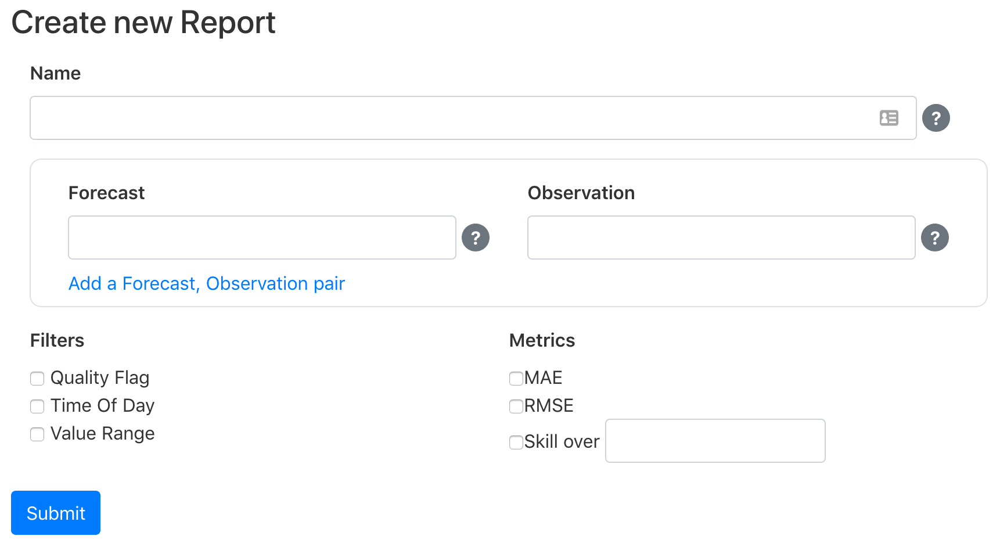

# Reports

The Solar Forecast Arbiter's reports are the primary outputs of the project. The reports compare one or more observations to one or more forecasts. The reports include graphics and metrics that support users in determining the relative merits of forecasts.

The report functionality is currently incomplete, but we invite stakeholders to provide feedback on the proposed interfaces and samples. Trials may follow a similar procedure.

Go to the dashboard's [reports page](https://dashboard.solarforecastarbiter.org/reports/) to see a list of reports that your account may access.

## Create new report

Clicking *Create new Report* will display a form that allows you to input the metadata that describes a new report.

The report requires a descriptive name such as "Utility X Q1 analysis". Users select the forecast and observation pairs by clicking on the empty fields for each item and selecting the metadata from a menu (not implemented). Additional forecast and observation pairs may be added by clicking "Add a Forecast, Observation pair".

Filters may be specified that control what data is allowed or disallowed in the calculation.

Metrics to be calculated may selected and an option is provided to select a forecast for a skill metric.

Once the report metadata is complete, the user clicks *Submit* and the Solar Forecast Arbiter queues up the report calculation. The report calculation may take seconds to minutes. For the initial release, the user must manually refresh the [reports page](https://dashboard.solarforecastarbiter.org/reports/) to check the status of the report calculation.

## View report

A [sample report](https://dashboard.solarforecastarbiter.org/reports/fake_uuid) may be selected from the [reports page](https://dashboard.solarforecastarbiter.org/reports/).

First, the report will display the metadata that was used to specify its contents. The top section will also contain links to download the report in HTML or PDF formats.

A **Data** section summarizes the operations that were applied to align and resample the observation and forecast data. Time series and scatter plots display the observation and forecast data. The graphs are interactive and allow the user to zoom, pan, and save static images. A *data validation* sub-section summarizes any issues identified in the raw data and the strategy employed for addressing them.

Next, the **Metrics** section displays tables and graphs of the desired metrics. These graphs and tables are also interactive. Metrics are broken into subsections for total analysis period and monthly, daily, and hourly groupings.

A **Versions** section summarizes the versions of all relevant packages used in the creation of the report.

Finally, a **Hash** section contains information that allows a user to verify that the report was created by solarforecastarbiter.org.
